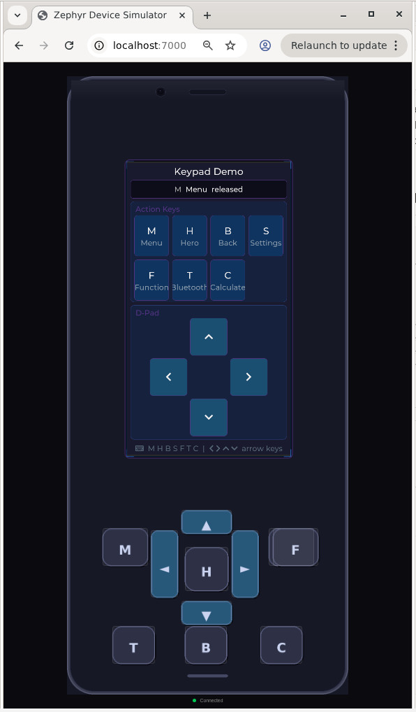

This tool is for emulating real devices with zephyrs native sim and show the output within a web page.
Additionally the web page also shows an image of the front side of the case with all the buttons. The buttons are clicklable and send gpio up and down events. 

# Run demo
## Requirements
- A working zephyr build environmant for native sim
- python3
- Xvfb, x11vnc and websockify installed on the local machine

##
Go to the directory where the run.sh is located
sh run.sh
open your webbrowser on http://localhost:7000

# Licenses
All - execept the web/vendor directory - is licensed under the apache 2.0 license. 
The vendor licenses are mentioned in the according directories

https://www.youtube.com/watch?v=qRP5dsVfJUk
