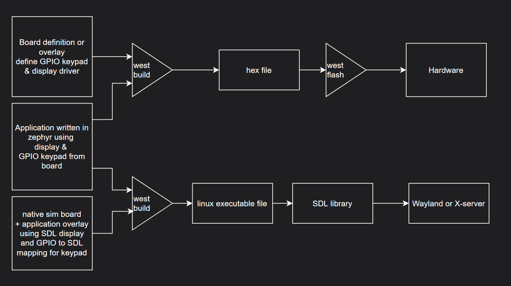
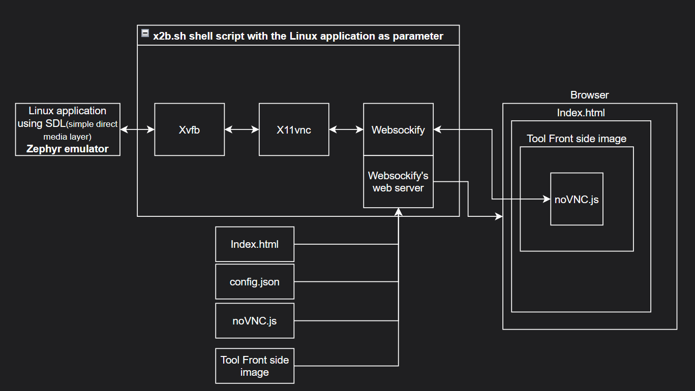

# Purpose
Showing and testing the complete device via web link by using the same code which runs on the device

# Requirements
* Run the emulator on each desktop (Windows, Linux, MacS...) without much hassle. Ideal would be no installation required
* Define a Zephyr hardware abstraction to run the same code as in the application, just interface with the emulator.
* show the complete device, not just the display
* No #ifdefs in the code shall be used

 
# Solution
* Emulating Zephyr applications using native sim on Linux
* Making the Emulator code accessible via Browser
* Create a display output on the Linux screen by adding a board overlay file to the zephyr project for native_sim. The display will have the same size and color mapping as the HW-target
* Use the zephyr native_sim target to show the display content on a X-Window / SDL2 canvas is possible.
  * Problems:
    * Only the display screen is visible, not the complete device
    * Keypad is still not supported
    * does work on linux only
* Linux is capable of routing the UI to a different Display. Remotely or locally simply by using the DISPLAY environment variable
* Start a X server without a physical device attached, writing to a virtual frame buffer in memory (Xvfb)
* An VNC server can be attached to the virtual frame buffer and make the UI available via VNC (x11vnc)
* Use websockify to tunnel the vnc TCP conncection thru a websocket and also serve the static html files for the browser
* using noVNC javascript library to connect from the web page to the vnc server and therefor showing the nativ_sim display on the browser
* using html to surround the vnc screen with an image of the tool case including buttons
* Defining rectangles on top of the buttons which route keyboard events to via the VNC server to the native_sim display
* Have a DTS overlay file to route the VNC keypad events to simulated GPIOs which have the same names as on the real hardware

## Build process overview

## Web export block diagram

# Run demo
## Requirements
- A working zephyr build environmant for native sim
- python3
- Xvfb, x11vnc and websockify installed on the local machine

##
Go to the directory where the run.sh is located
sh run.sh
open your webbrowser on http://localhost:7000

https://www.youtube.com/shorts/F02wGuafyts

# ToDo's
* create a shield or board instead of an overlay only
* Execute the web server via west flash or west build .. -t run
  * possibly also open the bowser as well
* extract the device case and display size a bit better to be useable as target board or shield

# Licenses
All - execept the web/vendor directory - is licensed under the apache 2.0 license. 
The vendor licenses are mentioned in the according directories

